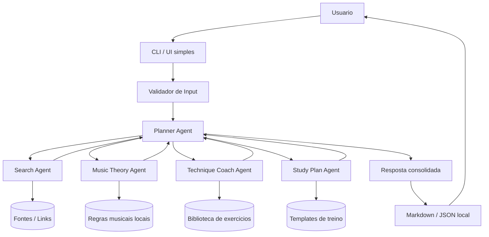
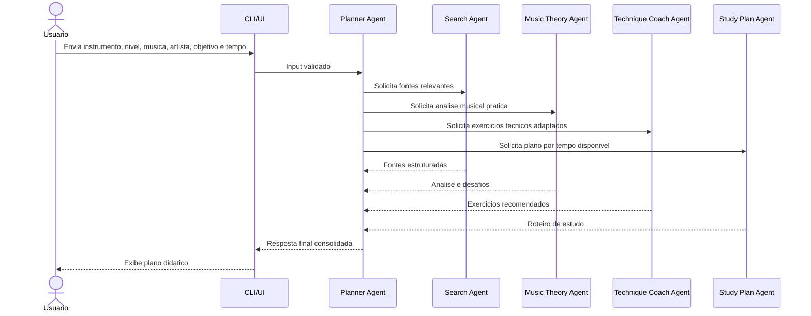

# Arquitetura Inicial do MVP

## Objetivo

Definir uma arquitetura local, simples e versionavel para o MVP do AI Music Teacher Agent. O sistema deve receber um input estruturado, orquestrar agentes especializados e devolver uma resposta didatica com fontes, analise, exercicios e plano de estudo.

## Decisoes Iniciais

- Interface inicial: CLI Python, com possibilidade de evoluir para Streamlit.
- Orquestracao: camada propria simples no MVP, preparada para migracao para LangGraph ou CrewAI.
- Persistencia: arquivos JSON locais para historico e outputs.
- Busca: provedor abstrato, iniciando com resultados mockados/configuraveis para evitar dependencia externa obrigatoria.
- LLM: adaptador isolado, permitindo execucao com OpenAI API quando configurada e fallback deterministico para desenvolvimento/testes.

## Componentes



## Fluxo de Agentes



## Contrato de Entrada

```json
{
  "instrumento": "violao",
  "nivel": "iniciante",
  "musica": "Aquarela do Brasil",
  "artista": "Ary Barroso",
  "objetivo": "aprender base",
  "tempo_disponivel": 20
}
```

## Contrato de Saida

```json
{
  "fontes": [],
  "analise": {
    "resumo": "",
    "tom_estimado": "",
    "progressao": "",
    "desafios": []
  },
  "exercicios": [],
  "plano_estudo": {
    "tempo_total": 20,
    "blocos": []
  }
}
```

## Responsabilidades

| Agente | Responsabilidade | Saida |
| --- | --- | --- |
| Planner Agent | Interpretar input, coordenar agentes e consolidar resposta | Resposta final |
| Search Agent | Encontrar ou sugerir fontes relevantes | Lista de links categorizados |
| Music Theory Agent | Explicar harmonia, forma e desafios musicais | Analise pratica |
| Technique Coach Agent | Transformar objetivo em exercicios | Exercicios por nivel/instrumento |
| Study Plan Agent | Dividir treino conforme tempo disponivel | Plano em blocos |

## Riscos e Mitigacoes

| Risco | Mitigacao |
| --- | --- |
| Dependencia de busca externa instavel | Comecar com provedor mockado e interface plugavel |
| Respostas musicais muito genericas | Templates por objetivo, instrumento e nivel |
| Reproducao indevida de material protegido | Usar explicacoes, trechos curtos e links, sem copiar cifras completas |
| Escopo crescer antes do MVP | Backlog pequeno, checkpoints de PM e QA |
