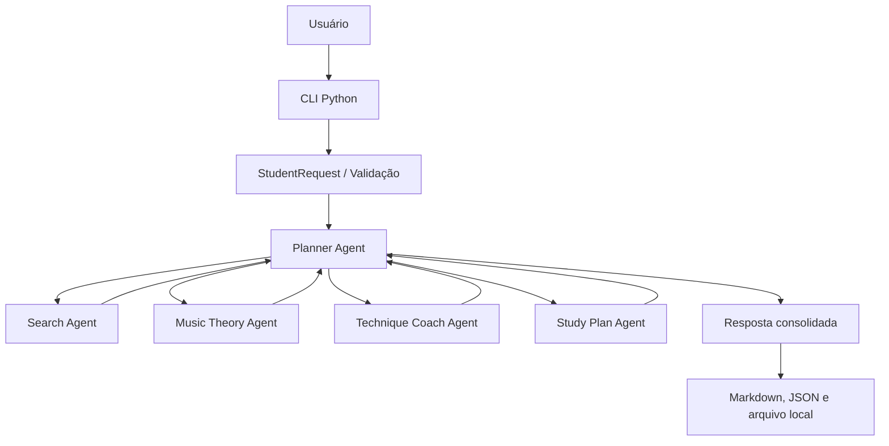

# AI Music Teacher Agent

MVP local de um professor de música agêntico para violão de nylon e cavaquinho, com foco em estudo prático de música brasileira.

O sistema recebe um pedido estruturado do estudante, orquestra agentes especializados e devolve um plano de estudo com fontes, análise musical, exercícios técnicos e divisão do treino por tempo disponível.

## Sumário

- [Estado atual](#estado-atual)
- [Objetivo do projeto](#objetivo-do-projeto)
- [Para quem é](#para-quem-é)
- [O que o MVP faz](#o-que-o-mvp-faz)
- [Arquitetura do MVP](#arquitetura-do-mvp)
- [Squad Agêntica](#squad-agêntica)
- [Estrutura de pastas](#estrutura-de-pastas)
- [Requisitos](#requisitos)
- [Como executar](#como-executar)
- [Entrada esperada](#entrada-esperada)
- [Saída gerada](#saída-gerada)
- [Testes](#testes)
- [Documentação do projeto](#documentação-do-projeto)
- [Regras de evolução](#regras-de-evolução)
- [Roadmap](#roadmap)
- [Troubleshooting](#troubleshooting)

## Estado atual

O projeto está na fase `mvp`.

Status do Sprint 01 conforme `context.yaml`:

- objetivo: entregar MVP local via CLI com agentes orquestrados e testes automatizados;
- status: `qa_passed_pending_pm_final_approval`;
- execução atual: CLI Python local;
- persistência atual: arquivos JSON locais;
- cloud: fora do escopo neste momento.

## Objetivo do projeto

Construir um sistema agêntico que funcione como professor de música personalizado para:

- estudantes de violão de nylon;
- estudantes de cavaquinho;
- pessoas que querem aprender música brasileira com plano estruturado;
- estudos de samba, pagode, bossa nova e repertório brasileiro em geral.

O produto busca resolver um problema comum de estudo musical: o aluno quer aprender uma música, mas não sabe como transformar isso em uma rotina clara de prática.

## Para quem é

Este MVP foi pensado para estudantes que:

- têm uma música ou artista em mente;
- sabem quanto tempo têm para estudar;
- querem praticar com foco;
- precisam de orientação prática, não apenas uma lista de acordes;
- querem separar estudo de ritmo, técnica, harmonia e aplicação musical.

## O que o MVP faz

A versão atual:

- recebe instrumento, nível, música, artista, objetivo e tempo disponível;
- valida o input;
- gera fontes externas de referência;
- produz análise musical prática;
- sugere exercícios técnicos;
- monta um plano de estudo por blocos;
- imprime a resposta em Markdown ou JSON;
- opcionalmente salva o resultado em `outputs/`.

O MVP não faz, por enquanto:

- busca real em APIs externas;
- chamada a LLM;
- transcrição de áudio;
- leitura de MIDI;
- geração de partituras;
- reprodução integral de cifras protegidas por copyright;
- interface Streamlit.

## Arquitetura do MVP

O fluxo principal é:



### Agentes do produto

| Agente | Arquivo | Responsabilidade |
| --- | --- | --- |
| Planner Agent | `music_teacher/agents.py` | Orquestra os agentes especializados e consolida a resposta final. |
| Search Agent | `music_teacher/agents.py` | Gera fontes externas de referência para vídeos, cifras e aulas. |
| Music Theory Agent | `music_teacher/agents.py` | Explica harmonia, progressão, desafios e foco por nível. |
| Technique Coach Agent | `music_teacher/agents.py` | Converte o objetivo do aluno em exercícios práticos. |
| Study Plan Agent | `music_teacher/agents.py` | Divide o tempo disponível em blocos de treino. |

### Módulos de apoio

| Módulo | Responsabilidade |
| --- | --- |
| `music_teacher/cli.py` | Interface de linha de comando, parsing de argumentos e execução do fluxo. |
| `music_teacher/models.py` | Contrato de entrada, normalização e validação. |
| `music_teacher/formatters.py` | Conversão da resposta para Markdown. |
| `music_teacher/storage.py` | Salvamento local dos resultados em JSON. |

## Squad Agêntica

A Squad Agêntica é o modelo de trabalho definido para evoluir este projeto com papéis claros, checkpoints e entregáveis versionáveis.

O arquivo operacional original é:

- `codex-prompt.md`

O documento consolidado para consulta humana está em:

- `docs/squad-agentica.md`

### Papéis da Squad

| Papel | Função |
| --- | --- |
| Product Manager | Define regras, prioridades, critérios de aceite e aprova checkpoints. |
| Scrum Master | Divide o trabalho em tarefas pequenas e acompanha o fluxo do sprint. |
| Tech Lead | Define arquitetura, revisa decisões técnicas e protege a qualidade do código. |
| Developers Full-Stack | Implementam backend, possível UI e testes unitários. |
| QA Automation | Cria e executa testes automatizados, valida contratos e registra riscos. |
| UX | Define jornada, wireframes e valida a experiência de uso. |

### Checkpoints obrigatórios

- PM aprova arquitetura e backlog antes da implementação.
- PM aprova o resultado após QA antes do fechamento do sprint.
- Mudanças relevantes devem gerar artefatos versionáveis em Markdown, Mermaid, código ou testes.

## Estrutura de pastas

Estrutura oficial do projeto:

```text
AI-Music-Teacher-Agent/
  README.md
  pyproject.toml
  uv.lock
  .gitignore

  music_teacher/
    __init__.py
    agents.py
    cli.py
    formatters.py
    models.py
    storage.py

  tests/
    test_agents.py
    test_models.py
    test_storage.py

  docs/
    architecture-mvp.md
    qa-report-sprint-01.md
    sprint-01-backlog.md
    squad-agentica.md

  examples/
    request.json

  outputs/
  outputs-test/

  context.yaml
  spec.md
  codex-prompt.md
```

### Convenção adotada

O pacote Python fica em `music_teacher/` diretamente na raiz.

Para este MVP, não foi adotado `src/music_teacher/` porque o projeto ainda é pequeno, local e sem processo de distribuição como biblioteca. Essa mudança pode fazer sentido no futuro, quando houver empacotamento, CI mais rígido, múltiplas interfaces ou maior complexidade de dependências.

## Requisitos

- Python 3.10 ou superior.
- Nenhuma dependência externa declarada em `pyproject.toml`.

O projeto pode ser executado com:

- `python3`, em ambientes Linux/macOS onde `python` não existe no PATH;
- `python`, em ambientes onde esse alias já aponta para Python 3;
- `uv run python`, se `uv` estiver instalado.

## Como executar

### Executar pela CLI com argumentos

Linux/macOS:

```bash
python3 -m music_teacher.cli \
  --instrumento violao \
  --nivel iniciante \
  --musica Carinhoso \
  --artista Pixinguinha \
  --objetivo "aprender base" \
  --tempo-disponivel 20
```

Windows PowerShell:

```powershell
python -m music_teacher.cli `
  --instrumento violao `
  --nivel iniciante `
  --musica Carinhoso `
  --artista Pixinguinha `
  --objetivo "aprender base" `
  --tempo-disponivel 20
```

### Executar com JSON de entrada

Linux/macOS:

```bash
python3 -m music_teacher.cli --input-json examples/request.json
```

Windows PowerShell:

```powershell
python -m music_teacher.cli --input-json examples\request.json
```

### Imprimir JSON sem salvar arquivo

Linux/macOS:

```bash
python3 -m music_teacher.cli --input-json examples/request.json --json --no-save
```

Windows PowerShell:

```powershell
python -m music_teacher.cli --input-json examples\request.json --json --no-save
```

### Usar diretório de saída customizado

```bash
python3 -m music_teacher.cli \
  --input-json examples/request.json \
  --output-dir outputs
```

### Executar com `uv`

Se o Python global não estiver configurado, mas `uv` estiver instalado:

```bash
uv run python -m music_teacher.cli --input-json examples/request.json --json --no-save
```

## Entrada esperada

Exemplo de payload:

```json
{
  "instrumento": "violao",
  "nivel": "iniciante",
  "musica": "Carinhoso",
  "artista": "Pixinguinha",
  "objetivo": "aprender base",
  "tempo_disponivel": 20
}
```

### Campos aceitos

| Campo | Obrigatório | Valores aceitos |
| --- | --- | --- |
| `instrumento` | Sim | `violao`, `cavaquinho` |
| `nivel` | Sim | `iniciante`, `intermediario`, `avancado` |
| `musica` | Sim | Texto livre |
| `artista` | Sim | Texto livre |
| `objetivo` | Sim | `tirar intro`, `aprender base`, `entender harmonia` |
| `tempo_disponivel` | Sim | Inteiro entre 10 e 180 minutos |

## Saída gerada

A resposta consolidada contém:

- `input`: dados normalizados da solicitação;
- `fontes`: links sugeridos para busca externa;
- `analise`: resumo prático, tom estimado, progressão e desafios;
- `exercicios`: exercícios adaptados ao instrumento, nível e objetivo;
- `plano_estudo`: blocos de treino com duração;
- `observacoes`: alertas sobre uso de fontes externas e copyright.

Quando o salvamento está habilitado, a CLI grava um JSON em `outputs/` com nome parecido com:

```text
20260502T123456Z-carinhoso.json
```

## Testes

Rodar a suíte completa:

```bash
python3 -m unittest discover -s tests
```

Em Windows:

```powershell
python -m unittest discover -s tests
```

Com `uv`, se disponível:

```bash
uv run python -m unittest discover -s tests
```

### O que os testes cobrem

| Arquivo | Cobertura |
| --- | --- |
| `tests/test_models.py` | Validação e normalização do input. |
| `tests/test_agents.py` | Contrato do Planner e soma dos blocos de estudo. |
| `tests/test_storage.py` | Escrita do resultado em JSON local. |

## Documentação do projeto

| Arquivo | Uso |
| --- | --- |
| `spec.md` | Visão de produto, problema, escopo, agentes, roadmap e definição de pronto. |
| `context.yaml` | Contexto estruturado do projeto, fase, stack, entregáveis e status do sprint. |
| `codex-prompt.md` | Prompt fonte para operar a Squad Agêntica no Codex. |
| `docs/squad-agentica.md` | Documento humano com papéis, fluxo e regras da Squad Agêntica. |
| `docs/architecture-mvp.md` | Arquitetura inicial, diagramas Mermaid e responsabilidades dos agentes. |
| `docs/sprint-01-backlog.md` | Backlog do Sprint 01 com histórias e critérios de aceitação. |
| `docs/qa-report-sprint-01.md` | Relatório de QA do Sprint 01. |

## Regras de evolução

- Manter o projeto local-first até decisão explícita em contrário.
- Evitar cloud, banco externo e dependências desnecessárias no MVP.
- Preservar contratos de entrada e saída com testes.
- Não copiar cifras, partituras ou materiais proprietários integralmente.
- Usar links externos apenas como referência.
- Registrar decisões relevantes em `docs/`.
- Atualizar `context.yaml` quando status, artefatos ou stack mudarem.
- Atualizar este README quando a forma de executar ou testar mudar.

## Roadmap

### Fase 2: Memória e evolução

- Memory Agent para histórico do aluno.
- Progress Agent para ajuste de dificuldade.
- Feedback Agent para registrar percepção do estudante.

### Fase 3: MIDI

- leitura de arquivos MIDI;
- extração de notas;
- geração de cifra simplificada;
- exercícios derivados de MIDI.

### Fase 4: Transcrição de áudio

- integração com ferramentas de transcrição;
- extração de BPM, acordes e trechos;
- apoio para tirar músicas de ouvido.

### Fase 5: Inteligência musical avançada

- Style Agent para samba, pagode e bossa;
- Improvisation Agent;
- recomendações adaptativas por histórico.

## Troubleshooting

### `python: command not found`

Use `python3`:

```bash
python3 -m unittest discover -s tests
```

### `uv: command not found`

O `uv` é opcional neste momento. Use `python3` ou instale `uv` apenas se quiser esse fluxo de execução.

### A CLI salvou arquivos em `outputs/`

Esse é o comportamento padrão. Use `--no-save` para imprimir sem persistir:

```bash
python3 -m music_teacher.cli --input-json examples/request.json --json --no-save
```

### Quero alterar os agentes

Comece por `music_teacher/agents.py` e depois atualize ou adicione testes em `tests/test_agents.py`.

### Quero alterar o contrato de entrada

Atualize:

- `music_teacher/models.py`;
- `examples/request.json`;
- testes em `tests/test_models.py`;
- documentação em `README.md` e `spec.md`.
