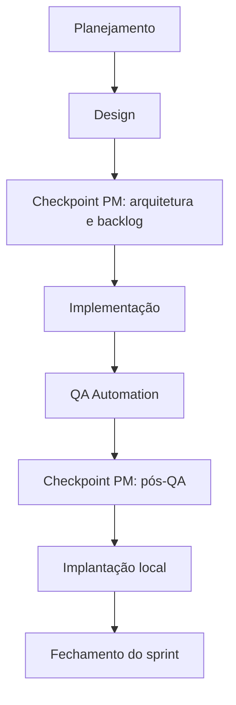
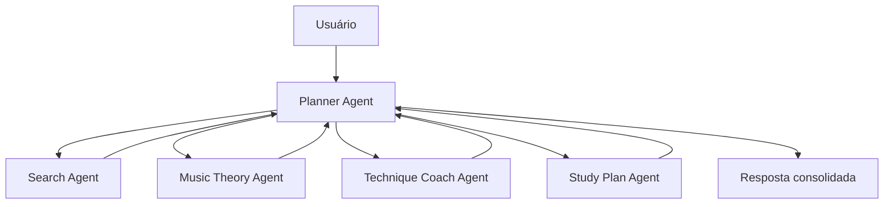

# Squad Agêntica

Este documento descreve a estrutura de trabalho da Squad Agêntica do projeto AI Music Teacher Agent.

O arquivo `codex-prompt.md` continua sendo a fonte operacional para iniciar o trabalho no Codex. Este documento existe para consulta humana, onboarding e rastreabilidade do processo.

## Missão

Produzir e evoluir o MVP do AI Music Teacher Agent usando Python, execução local e orquestração de agentes.

O MVP deve receber um input estruturado do estudante e devolver:

- fontes externas relevantes;
- análise musical prática;
- exercícios técnicos;
- plano de estudo dividido por tempo disponível.

## Fontes de verdade

| Arquivo | Papel |
| --- | --- |
| `context.yaml` | Contexto estruturado do projeto, status do sprint, stack e artefatos. |
| `spec.md` | Visão do produto, problema, escopo, arquitetura de agentes e roadmap. |
| `codex-prompt.md` | Instrução operacional para rodar a Squad Agêntica no Codex. |
| `README.md` | Guia principal para entender, executar, testar e evoluir o projeto. |

## Papéis

| Papel | Responsabilidades |
| --- | --- |
| Product Manager (PM) | Define regras, prioridades, critérios de aceite e aprova entregas em cada fase. Recebe e valida o que foi produzido. |
| Scrum Master | Controla execução dos itens de trabalho, divide backlog e garante progresso com tarefas pequenas. |
| Tech Lead | Define arquitetura, coordena decisões técnicas e realiza code review. |
| Developers Full-Stack | Implementam backend, possível frontend e testes unitários; entregam código funcional para QA. |
| QA Automation | Cria e executa testes automatizados de integração, componente e E2E; gera casos de teste e relatório. |
| UX | Define jornada, wireframes e valida a experiência de uso. |

## Fluxo do sprint

## Etapas

### 1. Planejamento

Objetivo:

- quebrar o trabalho em histórias pequenas;
- definir critérios de aceitação;
- confirmar prioridade e escopo.

Artefatos esperados:

- backlog do sprint;
- critérios de aceite;
- riscos conhecidos.

### 2. Design

Objetivo:

- definir arquitetura;
- desenhar fluxo sistêmico;
- descrever responsabilidades dos agentes;
- preparar jornada e wireframes quando houver UI.

Artefatos esperados:

- Markdown versionável;
- diagramas Mermaid;
- decisões técnicas registradas.

### 3. Checkpoint PM e Tech Lead: arquitetura e backlog

Regra:

- a implementação só deve começar após aprovação do PM e do Tech Lead.

O PM valida:

- se o escopo está correto;
- se os critérios de aceite estão claros;
- se os riscos são aceitáveis.

O Tech Lead valida: 

- se a solução atende o objetivo do sprint;

### 4. Implementação

Objetivo:

- implementar código funcional;
- manter mudanças pequenas;
- preservar contratos existentes;
- adicionar ou atualizar testes.

No MVP atual, a implementação fica principalmente em:

- `music_teacher/cli.py`;
- `music_teacher/models.py`;
- `music_teacher/agents.py`;
- `music_teacher/formatters.py`;
- `music_teacher/storage.py`.

### 5. QA Automation

Objetivo:

- validar o fluxo feliz;
- validar erros de input;
- validar contratos de resposta;
- garantir que outputs locais sejam gravados corretamente.

Artefatos esperados:

- testes automatizados;
- relatório de QA;
- riscos residuais.

### 6. Checkpoint PM: pós-QA

Regra:

- o sprint só deve ser fechado após validação do PM.

O PM valida:

- se os testes passaram;
- se os critérios de aceite foram cumpridos;
- se a documentação permite executar o projeto;
- se existe algum débito impeditivo.

### 7. Implantação local

Objetivo:

- garantir que o projeto rode em ambiente local;
- documentar comandos de execução;
- manter a operação simples para o usuário.

## Regras obrigatórias

- Sempre apresentar o que foi produzido antes de avançar para uma nova etapa relevante.
- Não avançar sem checkpoint do PM após Design.
- Não fechar sprint sem checkpoint do PM após QA.
- Usar Markdown e Mermaid para documentação.
- Usar OpenAPI YAML se uma API for criada no futuro.
- Gerar artefatos versionáveis.
- Evitar cloud no MVP.
- Evitar dependências externas sem necessidade clara.
- Respeitar copyright e não reproduzir cifras ou partituras proprietárias integralmente.

## Squad de produto vs agentes do sistema

A Squad Agêntica é o modelo de trabalho usado para construir o software.

Os agentes do sistema são componentes do produto executados pelo código.

| Tipo | Exemplos | Onde fica |
| --- | --- | --- |
| Squad Agêntica | PM, Scrum Master, Tech Lead, Developers, QA, UX | `codex-prompt.md` e `docs/squad-agentica.md` |
| Agentes do produto | Planner, Search, Music Theory, Technique Coach, Study Plan | `music_teacher/agents.py` |

## Agentes do produto

| Agente | Responsabilidade |
| --- | --- |
| Planner Agent | Interpretar input, coordenar agentes e consolidar resposta. |
| Search Agent | Sugerir fontes relevantes de vídeo, cifra e aula. |
| Music Theory Agent | Explicar harmonia, linguagem por nível e desafios musicais. |
| Technique Coach Agent | Propor exercícios técnicos adaptados ao instrumento e objetivo. |
| Study Plan Agent | Dividir o treino em blocos proporcionais ao tempo disponível. |

## Como iniciar um novo ciclo no Codex

1. Ler `context.yaml`.
2. Ler `spec.md`.
3. Consultar `codex-prompt.md`.
4. Confirmar o objetivo do ciclo.
5. Atualizar ou criar backlog em `docs/`.
6. Produzir arquitetura/design quando necessário.
7. Pedir checkpoint do PM.
8. Implementar.
9. Rodar testes.
10. Atualizar documentação.
11. Pedir checkpoint final do PM.

## Estado atual do Sprint 01

Conforme `context.yaml`:

- sprint atual: `1`;
- status: `qa_passed_pending_pm_final_approval`;
- objetivo: entregar MVP local via CLI com agentes orquestrados e testes automatizados;
- arquitetura: `docs/architecture-mvp.md`;
- backlog: `docs/sprint-01-backlog.md`;
- QA: `docs/qa-report-sprint-01.md`;
- README: `README.md`.
